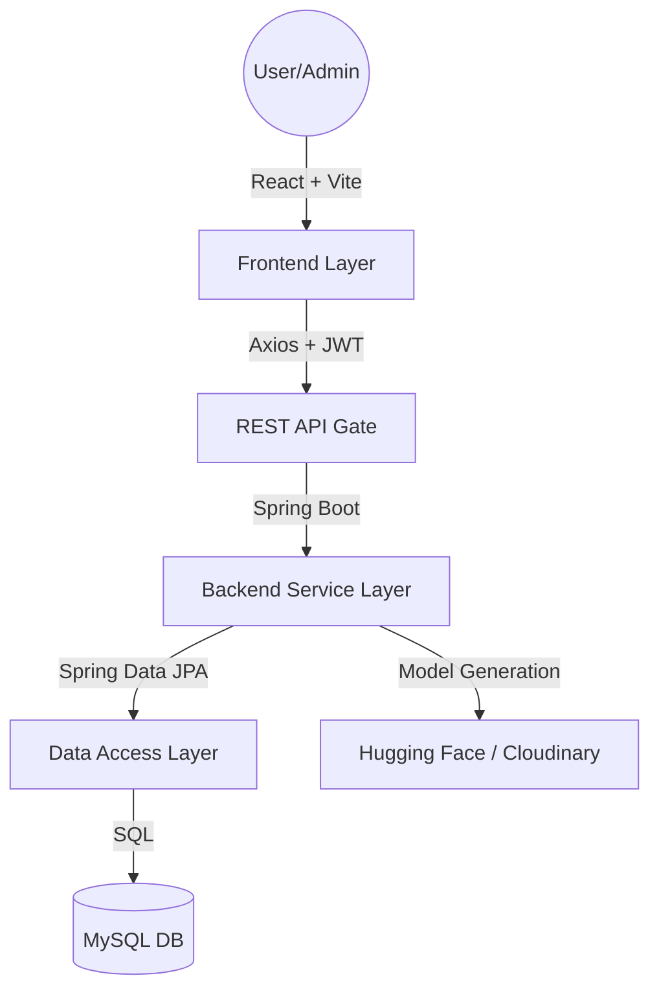

# College Project Report: SR FAB E-Commerce Platform
## Academic Project Documentation

---

### Phase 1: Project Introduction

#### 1.1 Project Title
**SR FAB - Premium 3D Integrated E-Commerce Platform**

#### 1.2 Introduction
In the modern digital era, the e-commerce industry is evolving beyond simple 2D catalogs. **SR FAB** is a comprehensive full-stack web application designed to revolutionize the fashion shopping experience. By integrating advanced **3D Model Visualization** with a robust enterprise-grade backend, SR FAB provides users with an immersive way to interact with garments virtually before purchase.

#### 1.3 Problem Statement
Traditional e-commerce platforms suffer from a high rate of product returns due to the disparity between product images and the actual physical item. Standard images often fail to convey the texture, fit, and 3D volume of premium garments.

#### 1.4 Objectives
- To develop a secure and scalable e-commerce backend using **Spring Boot**.
- To create a high-performance, responsive frontend using **React 19** and **Tailwind CSS**.
- To implement an interactive **3D Viewer** for product inspection.
- To manage user sessions securely using **JWT (JSON Web Tokens)**.
- To provide a comprehensive **Admin Panel** for inventory and order management.

---

### Phase 2: System Analysis

#### 2.1 Proposed System
The proposed system addresses the limitations of traditional stores by introducing:
- **3D Interactive Viewing:** Users can rotate and zoom in on garments in a 3D environment.
- **Micro-interaction UI:** Seamless transitions and animations provide a premium feel.
- **Stateless Authentication:** Enhances security and scalability.
- **Dynamic Catalog Grouping:** Smart logic to group variations (colors/sizes) under a single parent style.

#### 2.2 Software Requirements
- **Operating System:** Windows/Linux/macOS
- **IDE:** VS Code / IntelliJ IDEA
- **Runtime Environment:** Node.js v18+, Java 17 (JDK)
- **Database:** MySQL 8.0
- **Version Control:** Git

#### 2.3 Hardware Requirements
- **Processor:** 1.6 GHz or faster (i3/i5 recommended)
- **RAM:** 8 GB Minimum
- **Storage:** 500 MB for source code; plus database storage
- **Graphics:** WebGL-compatible browser for 3D features

---

### Phase 3: System Design

#### 3.1 High-Level Architecture
The system follows a **Decoupled Architecture** where the frontend and backend communicate via a RESTful API.

#### 3.2 Database Design (E-R Mapping)
| Entity | Key Attributes | Relationships |
| :--- | :--- | :--- |
| **User** | userId, name, email, password, address | 1:N with Orders |
| **Product** | productId, name, price, brand, fabricType | N:1 with Category, 1:N with Variants |
| **Category** | categoryId, categoryName | 1:N with Products |
| **Order** | orderId, status, totalAmount, date | N:1 with User, 1:N with OrderedProducts |
| **ProductVariant**| variantId, size, color, stock | N:1 with Product |
| **Model3D** | id, modelUrl, status | 1:1 with Product |

---

### Phase 4: Implementation Details

#### 4.1 Backend Implementation (Spring Boot)
- **Spring Security:** Configured to handle JWT stateless sessions.
- **REST Controllers:** Endpoints created for Auth, Products, Cart, and Orders.
- **Business Logic:** Services for calculating discounts, verifying coupons, and stock management.
- **File Handling:** Integration with Cloudinary for 2D images and 3D `.glb` assets.

#### 4.2 Frontend Implementation (React)
- **Context API:** 
    - `AuthContext`: Tracks user login status and roles (Admin/User).
    - `CartContext`: Manages the global shopping bag and persistent totals.
    - `ThemeContext`: Toggles between Premium Light and Sleek Dark modes.
- **Components:** Modular design using `ProductCard`, `Navbar`, and `ModelViewer`.
- **Three.js Scene:** Custom React Three Fiber environment with shadows, environment maps, and orbital controls.

#### 4.3 3D Rendering Pipeline
1. **Model Loading:** Uses `@react-three/drei`'s `useGLTF` with Draco decompression.
2. **Dynamic Tinting:** The 3D mesh material color is updated in real-time based on the selected product variant.
3. **Environment:** Studio-quality HDRI lighting for realistic garment representation.

---

### Phase 5: Key Modules

1.  **User Authentication Module:** Features Signup, Login, and Protected Routes.
2.  **Product Management Module:** Filtering by category, brand, and search; details viewing with size selection.
3.  **Shopping experience Module:** Global cart drawer, quantity updates, and subtotal calculations.
4.  **Checkout & Payments:** Address verification, discount logic (first order & coupons), and payment selection.
5.  **Admin Supervision:** Tabbed interface for managing site catalog and monitoring recent sales analytics.

---

### Phase 6: Conclusion

#### 6.1 Summary
The SR FAB project successfully demonstrates the integration of modern web technologies to create a high-performance e-commerce solution. The inclusion of 3D technology sets it apart from standard academic projects by addressing real-world user engagement problems.

#### 6.2 Future Enhancements
- **AR (Augmented Reality) Support:** Allowing users to view products in their physical space via mobile cameras.
- **AI Recommendations:** implementing machine learning to suggest products based on browsing history.
- **Integration of Payment Gateways:** Connecting with Razorpay or Stripe for live transactions.

---

### Phase 7: Bibliography
- *Spring Boot in Action* by Craig Walls.
- *React Documentation* (v19).
- *Three.js Journey* by Bruno Simon (Course Reference).
- *MDN Web Docs* for CSS/JS standards.
