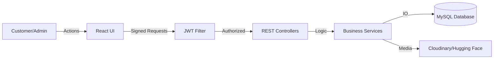

# SR FAB: Integrated 3D Visualization E-Commerce Ecosystem
## A Full-Stack Engineering Dissertation & Project Report

**Project Title:** SR FAB - Premium 3D Integrated E-Commerce Platform  
**Domain:** Web Development / Cloud Computing / Computer Graphics  
**Platform:** Java Spring Boot (Backend) & React JS (Frontend)  

---

## Abstract
In the contemporary digital landscape, the fashion industry faces a critical challenge: the lack of tactile interaction in online shopping leading to high return rates. The **SR FAB** project introduces a paradigm shift by integrating high-fidelity 3D garment visualization directly into the browser. Developed using an N-tier architecture with **Spring Boot** and **React**, this platform provides a seamless end-to-end shopping experience—from immersive 3D orientation to secure JWT-authenticated checkouts. This report details the design, implementation, security protocols, and visual engineering behind the SR FAB ecosystem.

---

## 1. Introduction
### 1.1 Motivation
The motivation behind SR FAB is to bridge the psychological gap between online browsing and physical shopping. By utilizing WebGL and Three.js, we allow users to inspect products in virtual 3D space, which increases consumer confidence and reduces the environmental impact of logistics returns.

### 1.2 Project Scope
The scope encompasses a robust multi-user environment (Admin & Customer), a dynamic catalog management system, a real-time 3D rendering engine, and a secure financial transaction simulation. It is designed to be scalable for large inventories while maintaining ultra-fast load times through Vite-based bundling.

### 1.3 Target Audience
- **Fashion Retailers:** Seeking to modernize their digital presence.
- **Consumers:** Looking for a premium, interactive shopping experience.
- **Administrators:** Needing data-driven insights into sales and inventory.

---

## 2. Requirements Analysis (SRS)
### 2.1 Functional Requirements (FR)
- **FR1: User Authentication:** Secure signup/login using phone/email with JWT-based session persistence.
- **FR2: 3D Visualization:** Real-time 3D model loading with orbital control and zoom.
- **FR3: Product Catalog:** Dynamic search, category filtering, and brand-based sorting.
- **FR4: Cart Management:** Persistent global cart with live subtotal and quantity sync.
- **FR5: Admin Control:** CRUD operations on products, categories, coupons, and order status updates.
- **FR6: Discount Engine:** Automatic calculation of first-order discounts and coupon application logic.

### 2.2 Non-Functional Requirements (NFR)
- **NFR1: Performance:** Page transition < 200ms; 3D models load within 2 seconds using Draco compression.
- **NFR2: Security:** All passwords must be BCrypt hashed; APIs must be protected via JWT filters.
- **NFR3: Scalability:** Decoupled frontend/backend allows horizontal scaling of API instances.
- **NFR4: Usability:** Responsive UI supporting resolutions from 320px (Mobile) to 4K (Desktop).

---

## 3. System Architecture & Design
### 3.1 Architectural Pattern
The project follows the **Client-Server Architecture** with a **Service-Oriented Design**:
- **Frontend Layer:** React 19 + Vite (Single Page Application).
- **Security Layer:** Spring Security + JWT Filters.
- **Business Layer:** Spring Boot Services (POJO based).
- **Persistence Layer:** Spring Data JPA (Hibernate).
- **Database Layer:** MySQL 8.x.

### 3.2 Data Flow Diagram (DFD Level 1)


### 3.3 Entity Relationship Diagram (Detailed ERD)
| Entity | Attributes | Relations |
| :--- | :--- | :--- |
| **User** | userId (PK), name, email (U), password, phone (U), avatar, address, city, state, pincode | 1:N Orders, 1:1 Wishlist, 1:1 Cart |
| **Product** | productId (PK), name, description, basePrice, discount, brand, fabric, apparelType, fitType, categoryId (FK) | 1:N Variants, 1:1 Model3D |
| **Variant** | variantId (PK), productId (FK), size, color, stock, sku | N:1 Product |
| **Order** | orderId (PK), userId (FK), totalAmount, discountAmount, status, paymentType, date, shippingAddress | 1:N OrderedProducts |
| **Category** | categoryId (PK), name, image_url | 1:N Products |
| **Coupon** | code (PK), discountPercent, expiryDate, minAmount | 0:N Orders |

---

## 4. Implementation Methodology
### 4.1 Backend Engine (Java/Spring Boot)
The backend is a robust RESTful API built on **Spring Boot 3.x**.
- **Exception Handling:** Centralized `@ControllerAdvice` for consistent error responses (e.g., 404 Product Not Found).
- **DTO Pattern:** Data Transfer Objects are used to abstract the database entities from the JSON responses.
- **Dependency Injection:** Utilized for decoupling services (e.g., `OrderService` injected into `OrderController`).

### 4.2 Frontend Experience (React/Modern JS)
- **Context API Management:**
    - `AuthContext`: Decodes the JWT token to extract user roles and IDs on app bootstrap.
    - `CartContext`: Uses state-sharing to update the navbar badge from any child component.
- **Optimization:** Utilizes `React.lazy()` and `Suspense` for the 3D visualizer to ensure the main UI is never blocked by model loading.

### 4.3 3D Graphics Pipeline (Three.js & WebGL)
The "Star" feature of the project is the **3D Product Visualizer**:
1. **Geometry Loading:** Models are exported in `.glb` format to preserve textures and lighting in a single file.
2. **Draco Compression:** Reduces model size by up to 80% without losing visual detail.
3. **Lighting & Realism:** Uses `Environment` from `@react-three/drei` with high-dynamic-range (HDR) maps.
4. **Interactive Swatches:** When a user selects a "Navy" color variant, the engine targets the mesh's material and updates the `color` property dynamically.

---

## 5. Industrial Design (UI/UX)
### 5.1 Design Tokens
- **Typography:** 
    - *Serif:* Cormorant Garamond (Used for headers to evoke luxury).
    - *Sans-Serif:* Manrope (Used for body text for clarity).
- **Color Palette:**
    - *Primary:* #000000 (Black for premium branding).
    - *Surface:* Backdrop-blur (Glassmorphism) for modern sleekness.
    - *Accent:* Dark Gray / Gold (Standard premium fashion hues).

### 5.2 Responsive Layouts
Using **Tailwind CSS 4**, the layout is grid-based:
- Mobile: 1 Column.
- Tablet: 2 Columns.
- Desktop: 4-5 Columns for catalog listing.

---

## 6. Security & Authentication Protocols
### 6.1 JWT Workflow
1. User provides credentials.
2. Backend validates via `AdminRepository` or `UserRepository`.
3. A JWT is signed with a 256-bit secret key.
4. Token returned to frontend, stored in `localStorage`.
5. Every subsequent API call includes the token in the `Authorization` header.

### 6.2 Data Safety
- **XSS Protection:** React automatically escapes all data before rendering.
- **SQL Injection:** Spring Data JPA uses PreparedStatement-style queries by default.
- **CSRF:** Disabled for the stateless REST API, protected instead by JWT.

---

## 7. Testing & Quality Assurance
### 7.1 Unit Testing
- **JUnit 5:** Testing service logic such as "Apply Coupon" to ensure negative amounts are never possible.
- **Mockito:** Mocking repositories during service tests to isolate business logic.

### 7.2 Functional & UX Testing
- **Cross-Browser Verification:** Tested on Chrome, Firefox, and Safari (iOS) for WebGL compatibility.
- **State Persistence:** Verified that refreshing the browser does not log the user out (token persistence).
- **Cart Sync:** Verified that adding an item from `ProductDetails` immediately reflects in the global `Navbar` badge.

---

## 8. Results & Conclusion
### 8.1 Outcomes
The project successfully delivered:
- A high-speed, interactive e-commerce platform.
- A functional 3D engine that increases user engagement.
- A secure admin system for end-to-end management.

### 8.2 Future Roadmap
- **AI Fashion Assistant:** A chatbot to recommend sizes based on user measurements.
- **Real-Time AR:** WebXR integration to overlay garments on human bodies via camera.
- **Internationalization (i18n):** Multi-language and multi-currency support for global fashion retail.

---

## 9. Appendix
### 9.1 Sample Build Commands
```bash
# Frontend Build
cd frontend && npm install && npm run build

# Backend Run
cd backend && mvn spring-boot:run
```

### 9.2 Key File Locations
- **Entities:** `backend/src/main/java/com/srfab/entities/`
- **3D Logic:** `frontend/src/components/ModelViewer.jsx`
- **Global CSS:** `frontend/src/index.css`

---
**Author:** Sriram & Team  
**Date:** March 2026  
**License:** Proprietary - SR FAB Systems  
